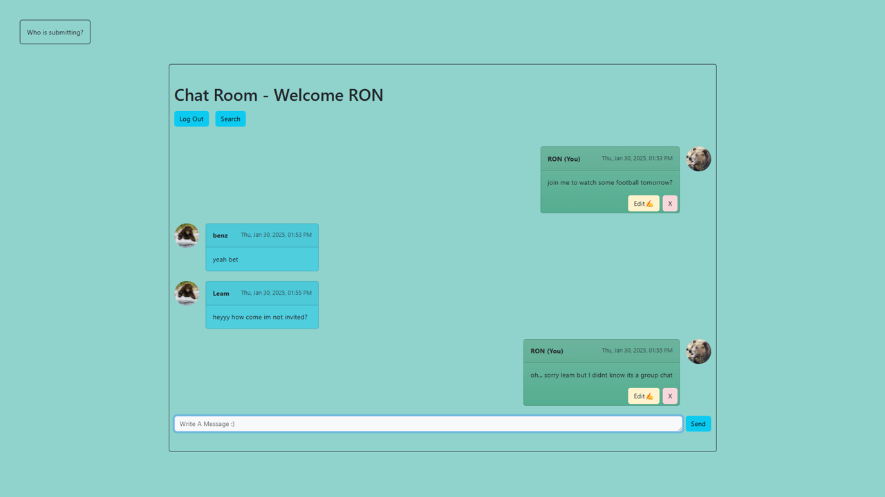
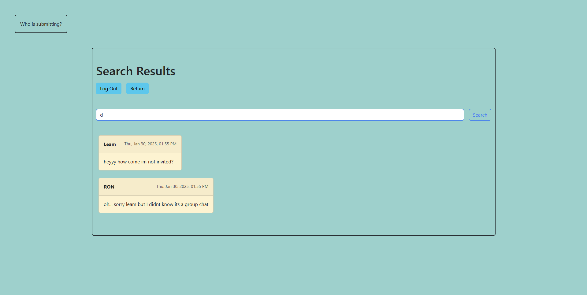

[](https://classroom.github.com/a/Ge_Ymx5m)

# Message Texting App

A simple web application built with Express.js, to edit and update messages with real-time UI updates and a back-end API integration.

## Features

- Send messages to a chat.
- View a list of messages.
- Edit messages inline using an input field.
- Updates are saved to the database via a RESTful API.

## Installation

1. Clone the repository:
   ```bash
   git clone https://github.com/Solange-s-Courses/ex4-nasa-ron-avital-and-david-weschler.git
   cd ex5-express-ron-avital-and-david-weschler
   ```
2. Install dependencies:
   ```bash
   npm install
   ```
3. Start the server:
   ```bash
   node app.js
   ```
   The app will be available at http://localhost:3000

## Authors

Always include all authors of the project, with their full names and emails (@edu.hac.ac.il).

<p>Email (as appearing in moodle): davidwes@hac.ac.il   Full Name: David Weschler</p>
<p>Email (as appearing in moodle): ronav@edu.hac.ac.il   Full Name: Ron Avital</p>

## Additional Information

This website was built with love. Enjoy it!

## Screenshots






